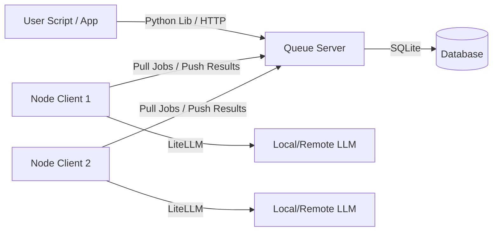
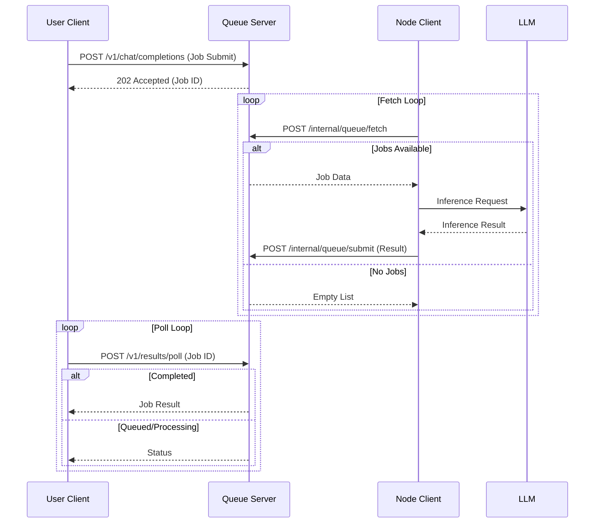

# OpenBeepBoop

OpenBeepBoop is a distributed, offline-first batch LLM inference orchestration system.

## Architecture



## Data Flow



## Installation

```bash
pip install openbeepboop
```

## Usage

### Server

```bash
openbeepboop-server setup
openbeepboop-server start
```

### Node

```bash
openbeepboop-node setup
openbeepboop-node run
```

### Client

```python
from openbeepboop import Client

client = Client(base_url="http://localhost:8000")
job = client.chat.completions.create(
    model="gpt-3.5-turbo",
    messages=[{"role": "user", "content": "Hello!"}]
)
print(job.get(wait=True))
```
