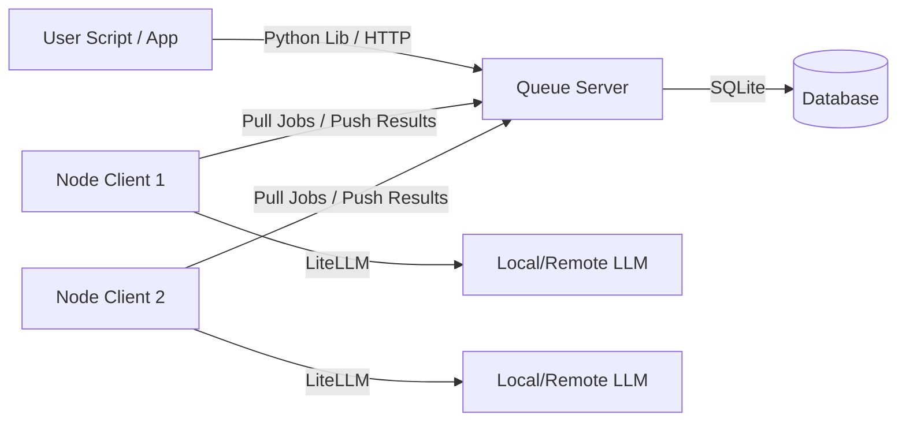
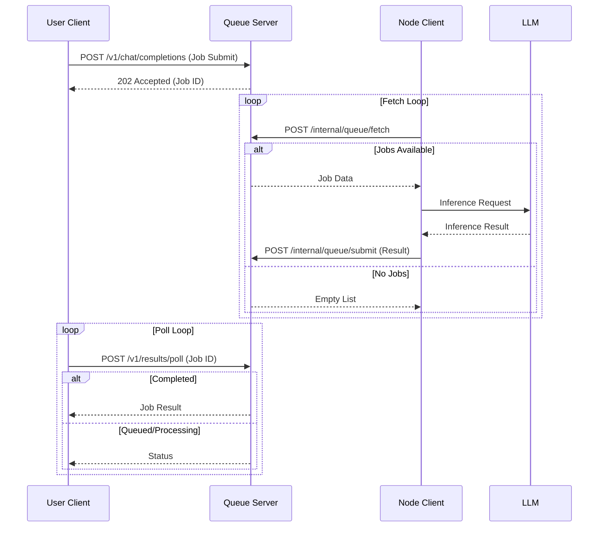

# OpenBeepBoop

OpenBeepBoop is a distributed, offline-first batch LLM inference orchestration system. It is designed to decouple request submission from inference execution, allowing for scalable, pull-based processing using heterogeneous compute nodes.

## Project Goals

*   **Distributed Architecture**: Decouple the client submitting requests from the nodes executing them.
*   **Offline-First**: Support batch processing where the client doesn't need to stay connected.
*   **Secure Pull-Based Nodes**: Nodes do not need to be internet-accessible. They operate on a pull model, fetching jobs from the server via outbound HTTP requests. This allows you to run secure, local LLM servers (behind firewalls or NAT) without exposing them to the public internet.
*   **Scalable**: Easily add more Node Clients to increase throughput.
*   **Heterogeneous Compute**: Use a mix of local GPUs (via Ollama, LM Studio) and remote APIs.

## Project Overview

OpenBeepBoop consists of three main components:

1.  **Queue Server**: A lightweight HTTP server backed by SQLite that acts as the central coordinator.
2.  **Node Client**: A worker that pulls requests, runs inference (using LiteLLM), and pushes results back.
3.  **User Library**: A Python client for easily submitting jobs and retrieving results.

### Key Features
*   **Easy Installation**: `pip install openbeepboop`
*   **Async API**: Submit now, retrieve later.
*   **Flexible Deployment**: Run nodes as daemons or cron jobs.
*   **Simple Configuration**: TOML-based config with interactive setup wizards.

## Basic Operation

The typical workflow involves setting up the server, configuring one or more nodes, and then using the CLI to submit jobs.

### 1. Installation

```bash
pip install openbeepboop
```

### 2. Server Setup

Start by setting up and running the Queue Server.

```bash
# Initialize configuration and database
openbeepboop-server setup

# Start the server (default port 8000)
openbeepboop-server start
```

### 3. Node Setup

On any machine with compute resources (or access to LLM APIs). Since nodes use a pull-based mechanism, this machine **does not** need to be reachable from the internet, it only needs to be able to reach the server.

```bash
# Configure the node (connect to server, define model)
openbeepboop-node setup

# Run the node in daemon mode
openbeepboop-node run
```

### 4. Basic Use Case (CLI)

You can interact with the system entirely via the CLI.

**Submit a Job:**

```bash
# Submit a job and wait for the result
openbeepboop-client submit "Explain quantum computing in one sentence." --wait
```

**Asynchronous Usage:**

```bash
# Submit a job (returns Job ID immediately)
openbeepboop-client submit "Write a short poem about rust."
# Output: Job submitted successfully. ID: job-uuid-1234

# Check status later
openbeepboop-client poll job-uuid-1234
```

## Architecture



## Data Flow



## Python Library Usage

For integration into Python applications, use the provided client library.

```python
from openbeepboop import Client

# Initialize client (point to your server)
client = Client(base_url="http://localhost:8000")

# Submit a job (returns immediately)
job = client.chat.completions.create(
    model="gpt-3.5-turbo",
    messages=[{"role": "user", "content": "Explain quantum computing in one sentence."}]
)
print(f"Job submitted with ID: {job.id}")

# Wait for result (blocking)
# In a real app, you might poll later instead of waiting
result = job.get(wait=True)
print("Result:", result.choices[0].message.content)
```

## CLI Commands

### Server CLI (`openbeepboop-server`)

*   `setup`: Interactive wizard to generate initial API key and database.
*   `start [--port <port>] [--host <host>]`: Start the server.

### Node CLI (`openbeepboop-node`)

*   `setup`: Interactive wizard to create `node_config.toml`.
*   `run`: Runs the node in a continuous loop (daemon mode).
*   `batch`: Runs once, processes available queue items, then exits (useful for Cron).

### Client CLI (`openbeepboop-client`)

*   `submit "Prompt text" [--model <model>] [--wait]`: Submit a job.
*   `poll <job_id> [--wait]`: Poll for job status and result.
