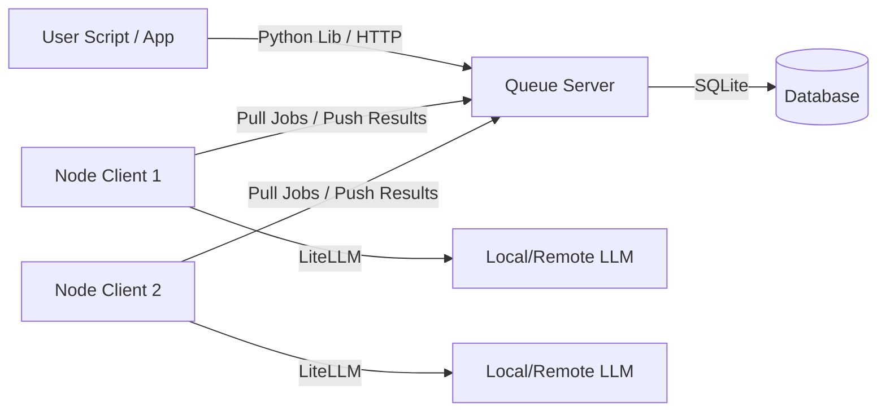

# OpenBeepBoop Specification

**OpenBeepBoop** is a distributed, offline-first batch LLM inference orchestration system. It is designed to decouple request submission from inference execution, allowing for scalable, pull-based processing using heterogeneous compute nodes.

## 1. Project Overview

The system consists of three main components:
1.  **Queue Server**: A lightweight HTTP server backed by SQLite that accepts inference requests and stores them.
2.  **Node Client**: A worker that pulls requests from the server, runs inference using LiteLLM (supporting local and remote models), and pushes results back.
3.  **User Library**: A Python client library simplifying interaction with the Queue Server for end-users.

**Key Features:**
- **Easy Installation**: Installable via `pip` or `uv`.
- **Async API**: Submit requests now, retrieve results later.
- **Distributed Processing**: Multiple nodes can process the queue simultaneously.
- **Flexible Deployment**: Nodes run in continuous daemon mode or single-batch cron mode.
- **Simplified Config**: TOML-based configuration with shortcuts for local LLM servers (e.g., Ollama, LM Studio).

---

## 2. Architecture



---

## 3. Data Model (SQLite)

The server uses a single SQLite database located in a standard XDG compliant directory (e.g., `~/.local/share/openbeepboop/queue.db` or `~/.openbeepboop/queue.db`).

### Schema

#### `jobs` Table
Stores the individual inference requests.

| Column | Type | Description |
| :--- | :--- | :--- |
| `id` | TEXT (UUID) | Primary Key. Unique Job ID. |
| `status` | TEXT | `QUEUED`, `PROCESSING`, `COMPLETED`, `FAILED`. |
| `created_at` | DATETIME | Timestamp of submission. |
| `updated_at` | DATETIME | Timestamp of last status change. |
| `request_payload` | JSON | The full JSON body of the request (OpenAI ChatCompletion schema). |
| `result_payload` | JSON | The result from the LLM (or error message). NULL if not done. |
| `locked_by` | TEXT | ID of the Node currently processing this job (for timeouts). |
| `locked_at` | DATETIME | Time when the node picked up the job. |

#### `api_keys` Table
Simple authentication management.

| Column | Type | Description |
| :--- | :--- | :--- |
| `key_hash` | TEXT | Hashed API key. |
| `name` | TEXT | Friendly name (e.g., "Node-1", "User-Alice"). |
| `role` | TEXT | `ADMIN`, `USER`, `NODE`. |

---

## 4. Server Specification

**Binary Name:** `openbeepboop-server`

### Commands
- `openbeepboop-server start [--port 8000] [--host 0.0.0.0]`
- `openbeepboop-server setup` (Interactive wizard to generate initial API key and DB)

### API Endpoints

#### User-Facing API
*Authenticated via Bearer Token*

1.  **Submit Inference**
    *   `POST /v1/chat/completions`
    *   **Behavior**: Accepts standard OpenAI ChatCompletion parameters. **Does not** wait for inference.
    *   **Response**: `202 Accepted`
        ```json
        {
          "id": "job-uuid-1234",
          "status": "queued"
        }
        ```

2.  **Poll Results**
    *   `POST /v1/results/poll` (POST used to allow sending list of IDs in body)
    *   **Body**: `{"ids": ["job-uuid-1234", ...]}` (Optional: if empty, return all completed user jobs or a page of them).
    *   **Response**:
        ```json
        {
          "jobs": [
            {
              "id": "job-uuid-1234",
              "status": "COMPLETED",
              "result": { ... OpenAI Completion Object ... }
            },
            {
              "id": "job-uuid-5678",
              "status": "QUEUED"
            }
          ]
        }
        ```

#### Internal Node API
*Authenticated via Bearer Token (Node Role)*

1.  **Fetch Jobs**
    *   `POST /internal/queue/fetch`
    *   **Body**: `{"limit": 10}`
    *   **Behavior**: Selects `limit` oldest `QUEUED` jobs, marks them `PROCESSING`, sets `locked_by` to Node ID.
    *   **Response**: List of Job objects with `request_payload`.

2.  **Submit Results**
    *   `POST /internal/queue/submit`
    *   **Body**:
        ```json
        [
          {"id": "job-uuid-1234", "result": {...}, "status": "COMPLETED"},
          {"id": "job-uuid-5678", "error": "Timeout", "status": "FAILED"}
        ]
        ```

---

## 5. Node Client Specification

**Binary Name:** `openbeepboop-node`

### Commands
- `openbeepboop-node run` (Runs in loop/continuous mode)
- `openbeepboop-node batch` (Runs once, processes available queue, then exits - for Cron)
- `openbeepboop-node setup` (Interactive wizard to create `node_config.toml`)

### Configuration (`node_config.toml`)
The setup wizard guides the user to create this file.

```toml
[server]
url = "http://localhost:8000"
api_key = "sk-..."

[llm]
# If using a standard remote provider supported by LiteLLM
model = "gpt-4o"
# api_key = "..." (set via ENV vars is preferred, but supported here)

[local_llm]
# Simplified shortcut for local servers
enabled = true
# If true, overrides 'llm.model' logic to point to local instance
port = 11434
# auto-constructs base_url and generic model name for LiteLLM
# e.g. maps to openai/http://localhost:11434/v1
```

### Logic
1.  **Fetch**: Request `N` jobs from Server (configurable batch size).
2.  **Process**: Loop through jobs. Use `LiteLLM` to invoke the model.
    *   If `local_llm.enabled` is true, construct the LiteLLM call using the simplified port/host.
3.  **Result**: Capture output or exception.
4.  **Submit**: POST results back to Server.
5.  **Loop/Exit**: Sleep and repeat (Daemon) or Exit (Batch).

---

## 6. User Python Library

A simple wrapper to interact with the system programmatically.

**Installation**: `pip install openbeepboop`

**Usage:**

```python
from openbeepboop import Client

client = Client(
    base_url="http://localhost:8000",
    api_key="sk-..."
)

# 1. Submit a job (Non-blocking)
job_handle = client.chat.completions.create(
    model="local-model",
    messages=[{"role": "user", "content": "Hello!"}]
)
print(f"Job submitted: {job_handle.id}")

# 2. Check status / Get result
# Blocks until finished if wait=True, or returns status immediately
result = job_handle.get(wait=True, timeout=60)

print(result.choices[0].message.content)

# 3. Bulk Poll
ids = ["job-1", "job-2"]
results = client.jobs.poll(ids)
for job in results:
    if job.is_completed:
        print(job.result)
```

---

## 7. Installation & Setup Flow

### Server Setup
1.  `pip install openbeepboop`
2.  `openbeepboop-server setup`
    *   *Prompt*: "Where should the database be stored? [default: ~/.local/...]"
    *   *Action*: Generates an Admin API Key.
    *   *Output*: "Setup complete. Run server with `openbeepboop-server start`. Your Admin Key is: sk-..."

### Node Setup
1.  `pip install openbeepboop` (on the node machine)
2.  `openbeepboop-node setup`
    *   *Prompt*: "Enter Queue Server URL:"
    *   *Prompt*: "Enter Node API Key:"
    *   *Prompt*: "Are you using a local LLM server? (y/n)"
    *   *If Yes*: "Which port? [11434]"
    *   *If No*: "Enter LiteLLM model name (e.g. gpt-4):"
    *   *Action*: Writes `node_config.toml`.

### Running
1.  Start Server: `openbeepboop-server start`
2.  Start Node: `openbeepboop-node run`
3.  Run User Script: Submits jobs via Python Lib.

---

## 8. Quality Assurance

All components of the `openbeepboop` project must adhere to high software quality standards.

*   **Unit Test Coverage**: A minimum of **90% unit test coverage** is required for all Python code, including the Server, Node Client, and User Library.
*   **Testing Framework**: Tests should be written using `pytest`.
*   **CI/CD**: Automated checks should enforce this coverage threshold on every pull request.

---

## 9. Documentation Requirements

The project documentation must be comprehensive and visual to ensure ease of use.

*   **README.md**: The repository's root `README.md` must include **Mermaid diagrams** that clearly explain the system architecture, data flow between components (Client, Server, Node), and the database schema interaction. This ensures that new users can grasp the distributed nature of the system at a glance.
